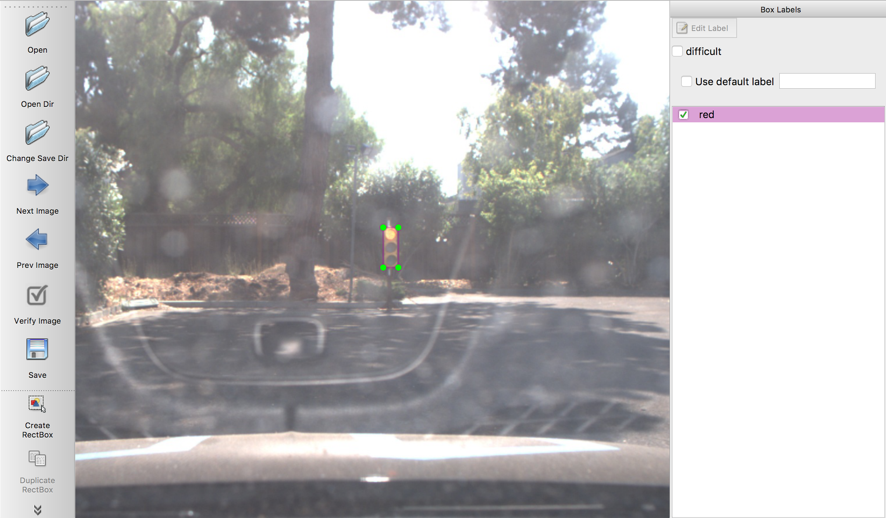
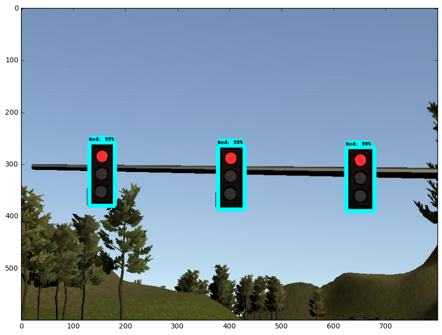
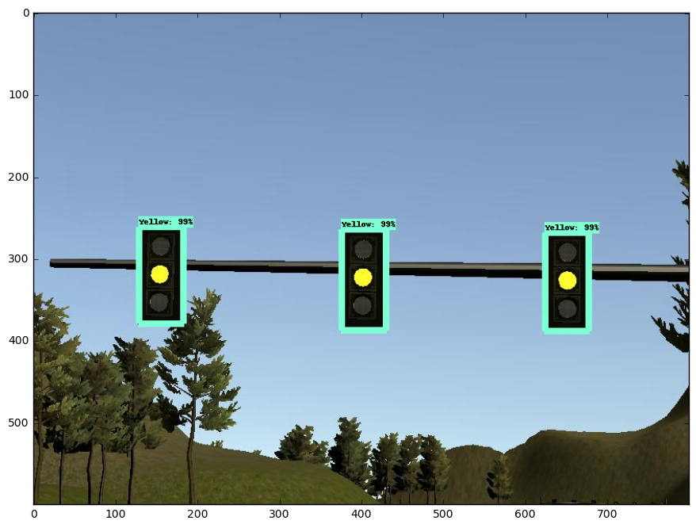
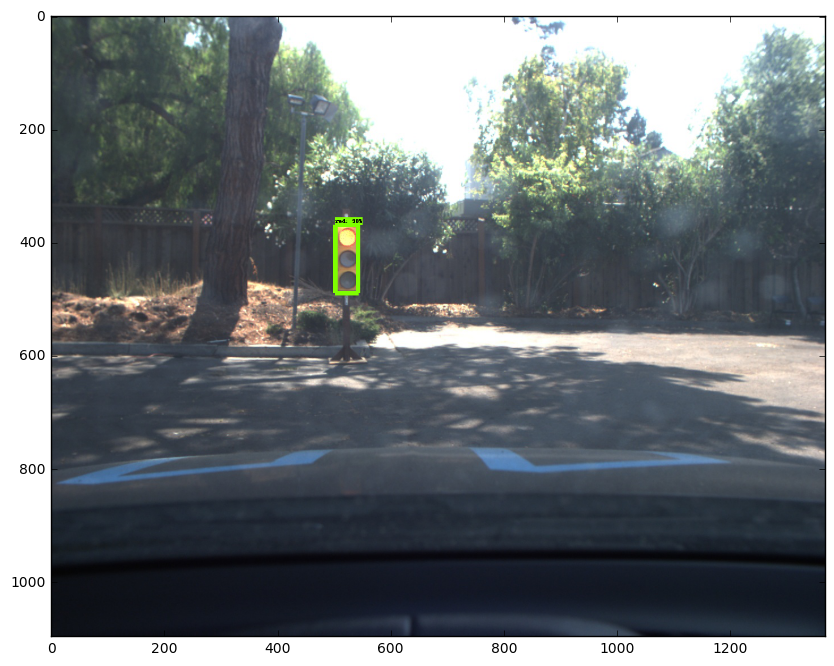
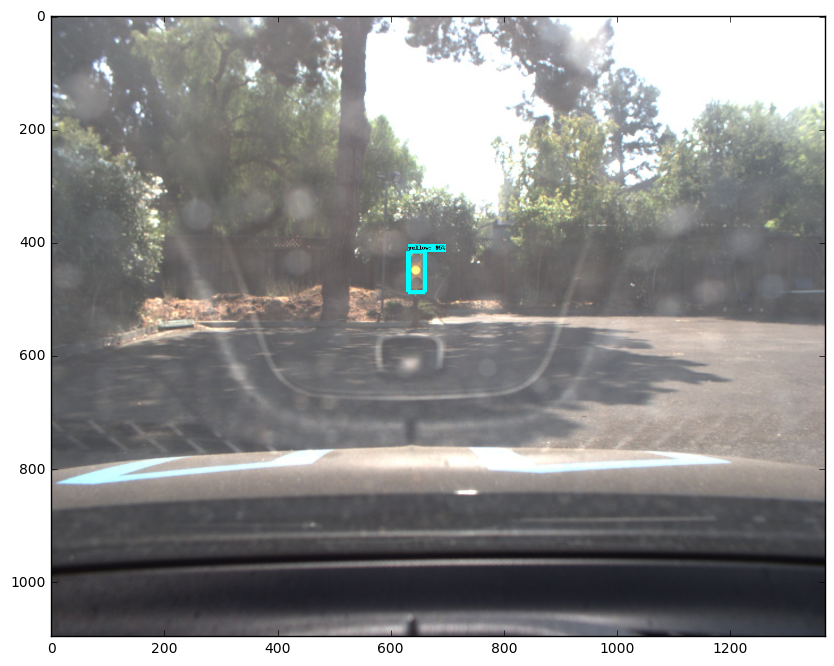
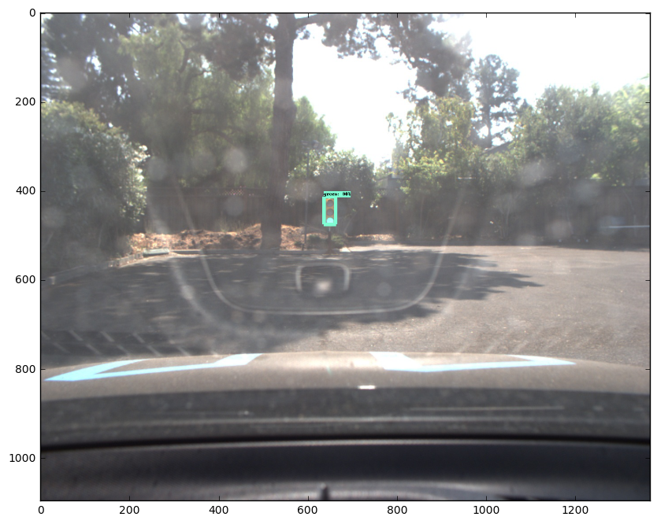

This is the project repo for the final project of the Udacity Self-Driving Car Nanodegree: Programming a Real Self-Driving Car from team "TEAMNAME" For more information about the project, see the project introduction [here](https://classroom.udacity.com/nanodegrees/nd013/parts/6047fe34-d93c-4f50-8336-b70ef10cb4b2/modules/e1a23b06-329a-4684-a717-ad476f0d8dff/lessons/462c933d-9f24-42d3-8bdc-a08a5fc866e4/concepts/5ab4b122-83e6-436d-850f-9f4d26627fd9).

In this project we wrote ROS nodes to implement core functionality of the autonomous vehicle system, including traffic light detection, control, and waypoint following.

Team:

| Name          | Email         |
| :----------------- |:-------------|
| Yuvaram Singh     | yuvaramsingh94@gmail.com |
| Patrick Wu        | sd4174263@163.com        |  
| Saravanan Moorthyrajan       | sarav_m@hotmail.com      |  
| Manasa Raghavan   | mraghavan@gmail.com      |

## Project Objective

The objectives of the System Integration project are:
* Smoothly follow waypoints in the simulator.
* Respect the target top speed set for the waypoints'
* Stop at traffic lights when needed.
* Stop and restart PID controllers depending on the state of /vehicle/dbw_enabled.
* Publish throttle, steering, and brake commands at 50hz.

## System Architecture
The ROS nodes implementing the Perception, Planning and Control sub-systems are shown in the figure below.


### Waypoint Updater Node
The Waypoint update node updates the waypoints ahead by calculating the distance and angle to the next waypoint ahead. In case a Red traffic light is detected, it calculates the waypoints up to the stop line.

### Controller Node
A PID controller is implemented in the DBW node to control the speed, throttle and brake commands out to the car control.

### Traffic Light Detector Node
The traffic light detector node detects the traffic light ahead based on the camera image received. The traffic light classifier was developed using [TensorFlow Object detection API](https://github.com/tensorflow/models/tree/master/research/object_detection) and following the guidelines provided in this [post](https://medium.com/@WuStangDan/step-by-step-tensorflow-object-detection-api-tutorial-part-1-selecting-a-model-a02b6aabe39e)

The first step was to create a training dataset of labeled images to use for the training the network. We used the training bag provided by [Udacity](https://s3-us-west-1.amazonaws.com/udacity-selfdrivingcar/traffic_light_bag_file.zip) , captured images from the simulator and the [Bosch Small traffic lights dataset](https://hci.iwr.uni-heidelberg.de/node/6132) to train our model.  We used the [LabelImg](https://github.com/tzutalin/labelImg.git) tool to annotate the images.



We leveraged the existing deep learning models available for object detection and used transfer learning to train our model for Traffic light classification. We used the [Region-Based Fully Convolutional Networks](https://arxiv.org/abs/1605.06409) (R-FCN) with [Resnet 101](https://arxiv.org/abs/1512.03385)

The results for classification:

 **Traffic light detection for simulator images:**
 
 
 

 **Traffic light detection on test site images:**
 
 
 

 *Note:* Given the size of the frozen graph, it could't be uploaded to Github. Please download it [from]() and save it under *<path_to_repo>/ros/src/tl_detector/light_classification*

### Native Installation

* Be sure that your workstation is running Ubuntu 16.04 Xenial Xerus or Ubuntu 14.04 Trusty Tahir. [Ubuntu downloads can be found here](https://www.ubuntu.com/download/desktop).
* If using a Virtual Machine to install Ubuntu, use the following configuration as minimum:
  * 2 CPU
  * 2 GB system memory
  * 25 GB of free hard drive space

  The Udacity provided virtual machine has ROS and Dataspeed DBW already installed, so you can skip the next two steps if you are using this.

* Follow these instructions to install ROS
  * [ROS Kinetic](http://wiki.ros.org/kinetic/Installation/Ubuntu) if you have Ubuntu 16.04.
  * [ROS Indigo](http://wiki.ros.org/indigo/Installation/Ubuntu) if you have Ubuntu 14.04.
* [Dataspeed DBW](https://bitbucket.org/DataspeedInc/dbw_mkz_ros)
  * Use this option to install the SDK on a workstation that already has ROS installed: [One Line SDK Install (binary)](https://bitbucket.org/DataspeedInc/dbw_mkz_ros/src/81e63fcc335d7b64139d7482017d6a97b405e250/ROS_SETUP.md?fileviewer=file-view-default)
* Download the [Udacity Simulator](https://github.com/udacity/CarND-Capstone/releases).

### Docker Installation
[Install Docker](https://docs.docker.com/engine/installation/)

Build the docker container
```bash
docker build . -t capstone
```

Run the docker file
```bash
docker run -p 4567:4567 -v $PWD:/capstone -v /tmp/log:/root/.ros/ --rm -it capstone
```

### Usage

1. Clone the project repository
```bash
git clone https://github.com/udacity/CarND-Capstone.git
```

2. Install python dependencies
```bash
cd CarND-Capstone
pip install -r requirements.txt
```
3. Make and run styx
```bash
cd ros
catkin_make
source devel/setup.sh
roslaunch launch/styx.launch
```
4. Run the simulator

### Real world testing
1. Download [training bag](https://drive.google.com/file/d/0B2_h37bMVw3iYkdJTlRSUlJIamM/view?usp=sharing) that was recorded on the Udacity self-driving car (a bag demonstraing the correct predictions in autonomous mode can be found [here](https://drive.google.com/open?id=0B2_h37bMVw3iT0ZEdlF4N01QbHc))
2. Unzip the file
```bash
unzip traffic_light_bag_files.zip
```
3. Play the bag file
```bash
rosbag play -l traffic_light_bag_files/loop_with_traffic_light.bag
```
4. Launch your project in site mode
```bash
cd CarND-Capstone/ros
roslaunch launch/site.launch
```
5. Confirm that traffic light detection works on real life images
